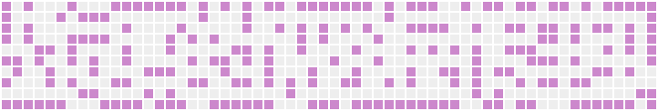
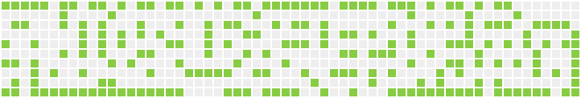

# Conway's Game of Life





The [Game of Life](https://en.wikipedia.org/wiki/Conway%27s_Game_of_Life), also known simply as Life, is a cellular automaton devised by the British mathematician John Horton Conway in 1970.

# Usage
All is written in Golang built-in packages. Be easy!

```
git clone https://github.com/Mohanson/gameoflife.git
go run game.go > game.gif
```

If you installed the ffplay, also can be used as
```
go run game.go | ffplay -
```
